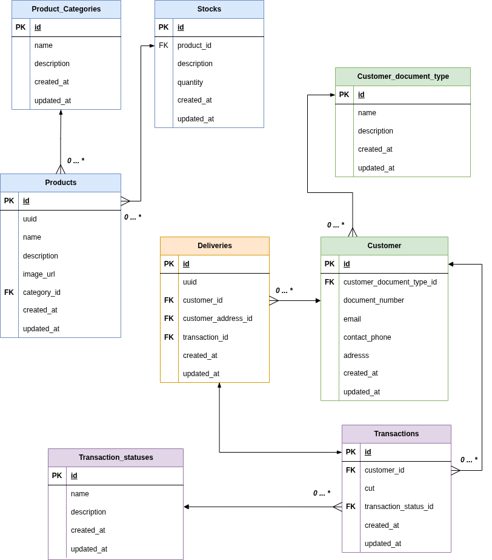

# Assessment DB Domain Service

A database-backed domain service built with [NestJS](https://nestjs.com/) and [Fastify](https://fastify.dev/), following **Hexagonal Architecture** (Ports & Adapters). It exposes a RESTful API for managing product catalogues, customers, transactions, deliveries and stock, backed by PostgreSQL via TypeORM.

---

## Table of Contents

- [Architecture](#architecture)
- [Tech Stack](#tech-stack)
- [Database Schema](#database-schema)
- [Prerequisites](#prerequisites)
- [Getting Started](#getting-started)
- [Environment Variables](#environment-variables)
- [API Reference](#api-reference)
- [Project Structure](#project-structure)
- [Testing](#testing)
- [Migrations and Seeds](#migrations-and-seeds)
- [Docker](#docker)
- [Design Decisions](#design-decisions)
- [License](#license)
- [Author](#author)

---

## Architecture

The codebase is organised into four distinct layers with dependencies flowing strictly inward:

```
Presentation  -->  Application  -->  Domain
                       |
                Infrastructure
```

| Layer | Location | Responsibility |
|---|---|---|
| **Domain** | `src/domain/` | Pure business entities, Zod schemas, domain errors. Zero external dependencies. |
| **Application** | `src/application/` | Use cases that orchestrate domain logic. Defines driving (input) and driven (output) port interfaces. |
| **Infrastructure** | `src/infrastructure/` | TypeORM repository adapters, ORM entities, persistence mappers, database configuration and seeds. |
| **Presentation** | `src/presentation/` | HTTP controllers, Zod validation pipes, DTOs, Swagger annotations. |
| **Shared** | `src/shared/` | Cross-cutting concerns: `Result<T,E>` type, base entity, DI tokens, guards, filters, interceptors. |

Full architectural documentation, including diagrams, boilerplate templates, and best practices, is available in [doc/ARQUITECTURE.md](doc/ARQUITECTURE.md).

---

## Tech Stack

| Concern | Technology |
|---|---|
| Runtime | Node.js 20+ |
| Framework | NestJS 10 with Fastify adapter |
| Language | TypeScript 5 (strict mode) |
| Database | PostgreSQL |
| ORM | TypeORM 0.3 |
| Validation | Zod 4 (request bodies) / Joi (environment variables) |
| API Docs | Swagger / OpenAPI via `@nestjs/swagger` |
| Security | Helmet, CORS, API key guard |
| Testing | Jest with SWC for compilation |
| Containerisation | Docker (multi-stage build, Alpine) |

---

## Database Schema



The schema consists of eight tables:

- **product_categories** -- product classification
- **products** -- catalogue items, each belonging to a category
- **stocks** -- inventory quantity per product (one-to-one)
- **customer_document_types** -- document type catalogue (CC, CE, NIT, PP, TI, DNI)
- **customers** -- registered customers with document and contact information
- **transaction_statuses** -- transaction lifecycle states (PENDING, APPROVED, DECLINED, VOIDED, ERROR)
- **transactions** -- purchase transactions linked to a customer and a status
- **deliveries** -- shipment records linked to a customer and a transaction

---

## Prerequisites

- Node.js >= 20
- npm >= 9
- PostgreSQL >= 14 (or a compatible managed instance)

---

## Getting Started

**1. Clone the repository**

```bash
git clone <repository-url>
cd assessment-db-domain-service
```

**2. Install dependencies**

```bash
npm install
```

**3. Configure environment variables**

Create your `.env` files under the `environment/` directory:

```
environment/
  development/.env
  production/.env
```

See [Environment Variables](#environment-variables) for the full list of supported keys.

**4. Run database migrations**

```bash
npm run migration:run
```

**5. Start the application**

```bash
# Development (watch mode)
npm run start:dev

# Production
npm run build
npm run start:prod
```

The server starts on the host and port defined by the `HOST` and `PORT` variables (defaults to `0.0.0.0:3000`).

---

## Environment Variables

All variables are validated at startup via Joi. The application will fail to boot if required variables are missing.

| Variable | Required | Default | Description |
|---|---|---|---|
| `NODE_ENV` | No | `development` | `development`, `production`, or `test` |
| `PORT` | No | `3000` | HTTP listen port |
| `HOST` | No | `0.0.0.0` | HTTP listen address |
| `LOG_LEVEL` | No | `debug` | `error`, `warn`, `info`, `debug`, `verbose`, `silly` |
| `CORS_ENABLED` | No | `true` | Enable CORS |
| `CORS_ORIGIN` | No | `http://localhost:3000,http://localhost:3001` | Comma-separated allowed origins |
| `API_PREFIX` | No | `/api` | Global route prefix |
| `API_VERSION` | No | `v1` | API version segment |
| `API_KEY_ENABLED` | No | `false` | Require `x-api-key` header on protected routes |
| `API_KEY` | No | *(dev default)* | Expected API key value |
| `ENABLE_SWAGGER` | No | `true` | Serve Swagger UI at `/docs` |
| `ENABLE_HEALTH_CHECK` | No | `true` | Enable `/health` endpoint |
| `APP_NAME` | No | `your-service-name` | Swagger document title |
| `APP_DESCRIPTION` | No | `service-name-description` | Swagger document description |
| `DB_HOST` | No | `localhost` | PostgreSQL host |
| `DB_PORT` | No | `5432` | PostgreSQL port |
| `DB_USERNAME` | **Yes** | -- | PostgreSQL user |
| `DB_PASSWORD` | **Yes** | -- | PostgreSQL password |
| `DB_DATABASE` | **Yes** | -- | PostgreSQL database name |
| `DB_SYNCHRONIZE` | No | `false` | Auto-sync schema (disable in production) |
| `DB_LOGGING` | No | `false` | Enable TypeORM query logging |
| `DB_SSL` | No | `false` | Enable SSL for the database connection |

---

## API Reference

All routes are prefixed with `{API_PREFIX}/{NODE_ENV}/{API_VERSION}` (e.g. `/api/development/v1`).

When Swagger is enabled, interactive documentation is available at `/docs`.

### Health

| Method | Path | Auth | Description |
|---|---|---|---|
| `GET` | `/health` | Public | Health check (database connectivity) |

### Product Categories

| Method | Path | Description |
|---|---|---|
| `POST` | `/product-categories` | Create a category |
| `GET` | `/product-categories` | List all categories |
| `GET` | `/product-categories/:id` | Get category by ID |
| `PATCH` | `/product-categories/:id` | Update a category |
| `DELETE` | `/product-categories/:id` | Delete a category |

### Products

| Method | Path | Description |
|---|---|---|
| `POST` | `/products` | Create a product |
| `GET` | `/products` | List all products (optional `?categoryId=` filter) |
| `GET` | `/products/:id` | Get product by ID |
| `PATCH` | `/products/:id` | Update a product |
| `DELETE` | `/products/:id` | Delete a product |

### Stock

| Method | Path | Description |
|---|---|---|
| `GET` | `/products/:productId/stock` | Get stock for a product |
| `PATCH` | `/products/:productId/stock` | Update stock for a product |

### Customers

| Method | Path | Description |
|---|---|---|
| `POST` | `/customers` | Create a customer |
| `GET` | `/customers` | List all customers |
| `GET` | `/customers/:id` | Get customer by ID |
| `PATCH` | `/customers/:id` | Update a customer |
| `DELETE` | `/customers/:id` | Delete a customer |

### Transactions

| Method | Path | Description |
|---|---|---|
| `POST` | `/transactions` | Create a transaction |
| `GET` | `/transactions` | List all transactions (optional `?customerId=` filter) |
| `GET` | `/transactions/:id` | Get transaction by ID |
| `PATCH` | `/transactions/:id` | Update a transaction |

### Deliveries

| Method | Path | Description |
|---|---|---|
| `POST` | `/deliveries` | Create a delivery |
| `GET` | `/deliveries` | List all deliveries (optional `?transactionId=` and `?customerId=` filters) |
| `GET` | `/deliveries/:id` | Get delivery by ID |

---

## Project Structure

```
src/
  domain/
    models/            Domain entities with co-located Zod schemas
    errors/            Domain-specific error classes
  application/
    ports/
      in/              Driving port interfaces (input boundaries)
      out/             Driven port interfaces (repository contracts)
    use-cases/         One class per use case, grouped by entity
  infrastructure/
    adapters/
      database/        TypeORM repository implementations
    config/            Database config, env validation, data source, seeds
    persistence/
      entities/        TypeORM ORM entity definitions
      mappers/         ORM <-> Domain entity mappers
  presentation/
    controllers/       HTTP controllers (one per resource)
    dtos/              Request/response DTO schemas (Zod-based)
    helpers/           Result-to-HTTP response mapping
    pipes/             ZodValidationPipe
  modules/             NestJS feature modules (DI wiring)
  shared/
    filters/           Global HTTP exception filter
    guards/            API key guard and @Public() decorator
    interceptors/      Request/response logging interceptor
    errors/            Infrastructure error wrapper
    base.entity.ts     Shared base entity with Zod base schema
    result.ts          Result<T,E> type with railway combinators
    di-tokens.ts       Centralised dependency injection tokens
  app.module.ts        Root application module
  main.ts              Bootstrap and server configuration

migrations/            TypeORM migration files
environment/           Environment-specific .env files
doc/                   Architecture docs and database schema diagram
```

---

## Testing

Tests use Jest with SWC for fast compilation. The test suite covers domain entities, use cases, mappers, controllers, pipes, guards, filters, and interceptors.

```bash
# Run all unit tests
npm test

# Run in watch mode
npm run test:watch

# Run with coverage report
npm run test:cov

# Run end-to-end tests
npm run test:e2e
```

Test files are located under `test/unit/` mirroring the `src/` directory structure. Use cases are tested with mocked repository ports, controllers are tested with mocked use cases, and domain entities are tested as pure units.

---

## Migrations and Seeds

### Migrations

The project uses TypeORM migrations for schema management. The CLI data source is configured in `src/infrastructure/config/data-source.ts`.

```bash
# Generate a new migration from entity changes
npm run migration:generate -- migrations/<MigrationName>

# Run pending migrations
npm run migration:run

# Revert the last migration
npm run migration:revert

# Show migration status
npm run migration:show
```

### Seeds

Reference data (transaction statuses and customer document types) is seeded automatically on application startup via `DatabaseSeederService`. The seeder uses `ON CONFLICT DO NOTHING` to remain idempotent across restarts.

A standalone seed script is also available:

```bash
npm run seed:run
```

---

## Docker

The project includes a multi-stage Dockerfile optimised for production:

- **Build stage** -- installs all dependencies, compiles TypeScript
- **Production stage** -- installs only production dependencies, runs as a non-root user

```bash
# Build the image
docker build -t assessment-db-domain-service .

# Run the container
docker run -p 3000:3000 \
  -e DB_USERNAME=postgres \
  -e DB_PASSWORD=secret \
  -e DB_DATABASE=assessment \
  assessment-db-domain-service
```

Environment variables can be injected at runtime or by mounting an `.env` file into the `environment/` directory.

---

## Design Decisions

**Hexagonal Architecture** -- Business logic is decoupled from framework and infrastructure concerns. Repositories are abstracted behind port interfaces and injected via DI tokens, making it straightforward to swap implementations.

**Result type over exceptions** -- Use cases return `Result<T, DomainError>` instead of throwing. This makes error paths explicit and composable via `map`, `flatMap`, and `asyncFlatMap` railway combinators. The presentation layer converts results to HTTP responses through `unwrapResult()`.

**Zod for request validation, Joi for env validation** -- Zod schemas are co-located with domain entities and reused for request DTOs, keeping a single source of truth for shape definitions. Joi handles environment variable validation at startup, leveraging its integration with `@nestjs/config`.

**Immutable domain entities** -- Entities expose factory methods (`create`, `fromPersistence`) and `applyUpdate` to produce new instances rather than mutating state.

**Explicit persistence mappers** -- ORM entities and domain entities are separate classes. Mappers at the repository boundary prevent ORM concerns from leaking into the domain layer.

**Fastify over Express** -- Fastify is used as the HTTP adapter for lower overhead and native async support.

**SWC for test compilation** -- Jest uses `@swc/jest` instead of `ts-jest` for significantly faster test execution.

---

## License

This project is licensed under the [GNU General Public License v3.0](LICENSE).

---

## Author

**Yoimar Moreno Bertel**

- Email: Yoimar.mb@outlook.com
- LinkedIn: [linkedin.com/in/yoimar-mb](https://www.linkedin.com/in/yoimar-mb/)
